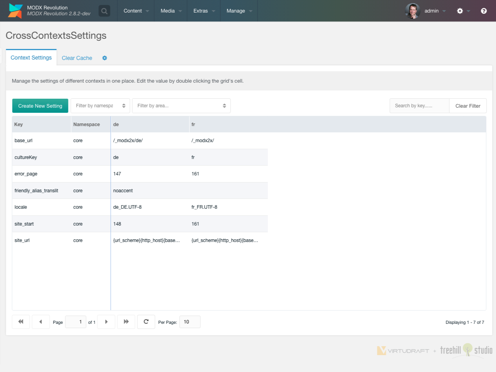
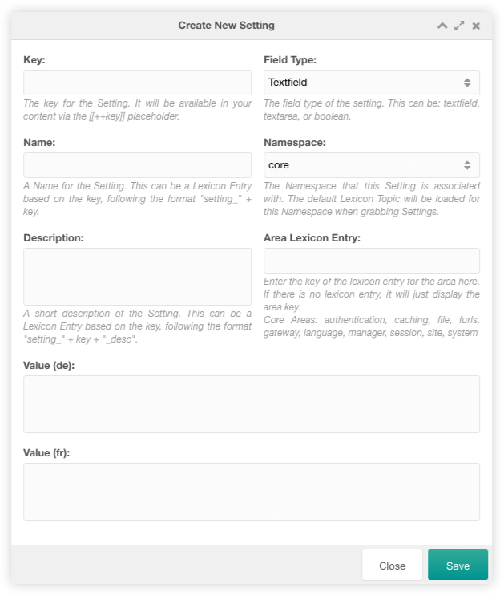
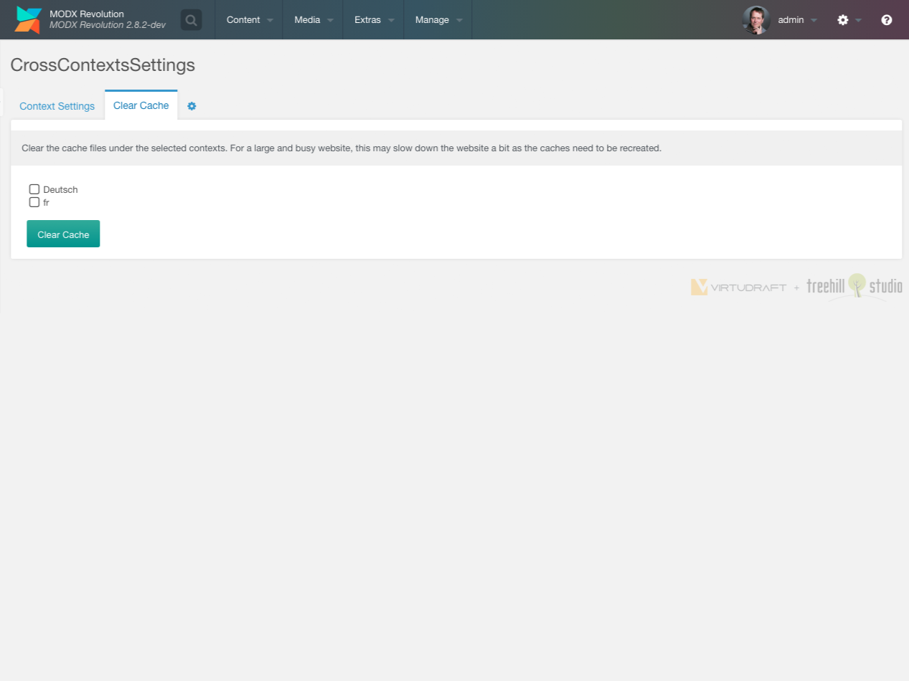
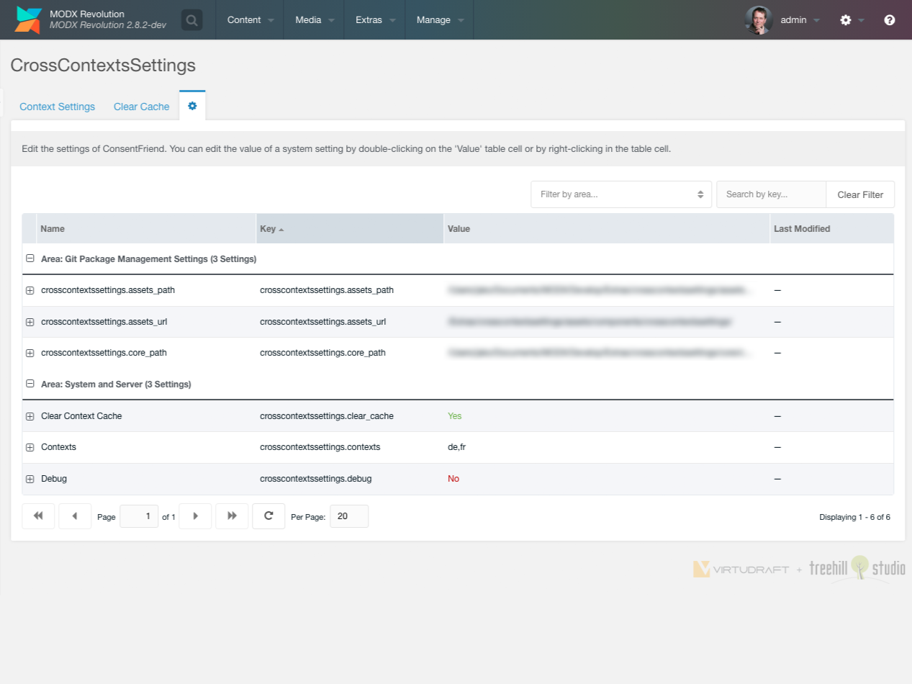

## Custom Manager Page

To use the component, navigate to your manager and click on "Extras > CrossContextsSettings".

You could create a new context setting in several contexts with a click on the
Create New Setting button on the top left above the contexts settings grid.

The grid could be filtered by the namespace, the area and with a search input on
the top right above the cronjob grid.

Each context setting can be edited inline with a double click on the text of the
setting.

## Create

The context setting create window has a variety of options that can be set.

You could set the setting key, the setting name, the setting description, the
setting field type, the setting namespace and the setting area. The fields in
that window are the same as in the default context setting create/edit window.

The values of each context setting can be filled below those fields in a
(sometimes scrollable) section. Each possible context setting is listed there
with `Value (context name)`:

## Clear Cache

The clear cache tab allows you to clear any context cache manually.

## Settings

The settings tab allows you to edit the system settings of
CrossContextsSettings.

CrossContextsSettings uses the following system settings in the namespace `crosscontextssettings`:

| Key                               | Name                | Description                                                                                                            | Default |
|-----------------------------------|---------------------|------------------------------------------------------------------------------------------------------------------------|---------|
| crosscontextssettings.clear_cache | Clear Context Cache | Clear the context cache after modifying an entry.                                                                      | No      |
| crosscontextssettings.contexts    | Contexts            | Comma separated list of contexts displayed in the custom manager page. No value means that all contexts are displayed. | -       |
| crosscontextssettings.debug       | Debug               | Log debug information in the MODX error log.                                                                           | No      |
